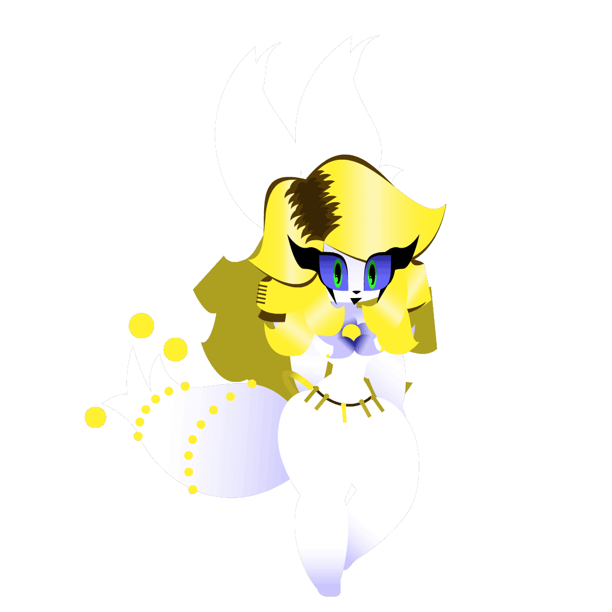

    

 <h2 align="center"> Graphic Designer and Front-end Developer!
</h2>
 

Hi, my name is Heitor S.S., i from Brazil and i learning Front-End on SENAI. On the moment all of the repositories are really basic, but soon, they all be the best!

 <h3 align="center">What i use:</h3>

    
    
    
    

^kitty Kate Casagrande^
<!--Atualizar sempre se caso-->
